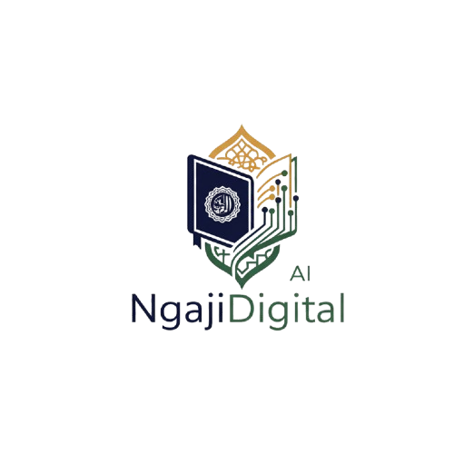

# NgajiDigital - Frontend

<div align="center">
  
  <h3>Belajar Ilmu Islam dengan AI</h3>
</div>

## 📖 Tentang Proyek

NgajiDigital adalah platform pembelajaran ilmu Islam berbasis AI yang dikembangkan untuk mempermudah akses terhadap pengetahuan tata bahasa Arab (Nahwu). Platform ini menggunakan sumber pengetahuan dari kitab "Mukhtashor Jiddan Syarah" karya Syekh Ahmad Zaini Dahlan.

> 🔗 **[Lihat Repository Backend](https://github.com/isaacnewton123/backend-ngaji-digital)**

### ✨ Fitur Utama

- **AI Nahwu Chat**: Berinteraksi dengan AI untuk mempelajari dan menganalisis tata bahasa Arab
- **Fokus pada Sumber Terpercaya**: AI hanya menggunakan pengetahuan dari kitab yang spesifik
- **Dukungan Markdown**: Jawaban AI ditampilkan dengan format Markdown untuk kemudahan membaca
- **UI Modern & Responsif**: Antarmuka yang bersih dan mudah digunakan di berbagai perangkat

## 🛠️ Teknologi

- React.js & TypeScript
- Material UI
- Framer Motion untuk animasi
- Axios untuk komunikasi API
- React Router untuk navigasi
- React-Markdown untuk rendering konten Markdown

## 🚀 Instalasi dan Penggunaan

### Prasyarat

- Node.js (versi 14 atau lebih baru)
- NPM atau Yarn
- Backend NgajiDigital (untuk fungsionalitas penuh)

### Cara Instalasi

Untuk pengguna Windows, kami menyediakan script PowerShell untuk mempermudah instalasi:

```powershell
# Clone repositori (jika belum)
git clone https://github.com/isaacnewton123/ngaji-digital.git
cd ngaji-digital/Frontend/ngaji-digital

# Jalankan script setup
.\fix-dependencies.ps1
```

Atau gunakan cara manual:

```bash
# Clone repositori (jika belum)
git clone https://github.com/isaacnewton123/ngaji-digital.git
cd ngaji-digital/Frontend/ngaji-digital

# Install dependensi
npm install

# Jalankan aplikasi dalam mode development
npm start
```

Aplikasi akan berjalan pada [http://localhost:3000](http://localhost:3000).

Anda dapat mempelajari lebih lanjut tentang backend di [Backend Ngaji Digital](https://github.com/isaacnewton123/backend-ngaji-digital)

### Konfigurasi

Pastikan backend sudah berjalan pada port 5000 untuk fungsionalitas penuh. Lihat README.md pada folder Backend untuk instruksi pengaturan backend.

## 📱 Screenshot

*Akan segera ditambahkan*

## 🧩 Struktur Proyek

```
ngaji-digital/
├── public/                 # Aset publik (logo, dll)
├── src/
│   ├── components/         # Komponen reusable
│   │   ├── Header.tsx      # Komponen header navigasi
│   │   ├── Footer.tsx      # Komponen footer
│   │   └── ThemeProvider.tsx # Penyedia tema MUI
│   ├── pages/              # Halaman aplikasi
│   │   ├── Home.tsx        # Halaman beranda
│   │   ├── NahwuChat.tsx   # Halaman chat AI Nahwu
│   │   └── About.tsx       # Halaman tentang aplikasi
│   ├── App.tsx             # Komponen utama dengan routing
│   └── index.tsx           # Entry point aplikasi
└── package.json            # Dependensi dan script
```

## 🔄 Alur Kerja

Frontend berkomunikasi dengan backend melalui API REST. Data percakapan tidak disimpan secara permanen (hanya dalam session), dan pemrosesan AI dilakukan di backend dengan Google Gemini API.

## 👥 Kontributor

- [Isaac Newton](https://github.com/isaacnewton123) - Developer & Maintainer

## 📝 Lisensi

Hak Cipta © 2024 NgajiDigital. Seluruh hak cipta dilindungi.

## 🔗 Tautan

- [Website](https://isaacnewton.site)
- [Twitter/X](https://x.com/isaac_newton252)
- [GitHub](https://github.com/isaacnewton123)
- [YouTube](https://www.youtube.com/@isaacnewton7777)
- [Instagram](https://www.instagram.com/hanifmaulana2)
- [Facebook](https://www.facebook.com/hanif.maulana.108)
